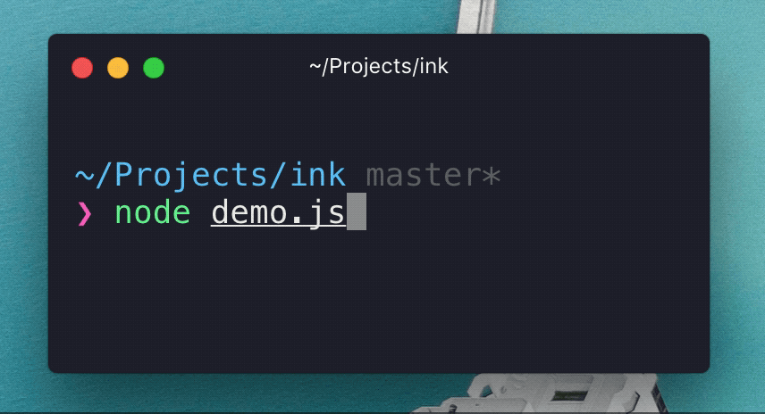

# Ink [](https://travis-ci.org/vadimdemedes/ink)

> React for CLIs

Build and test your CLI output using components.


## Install

```
$ npm install --save vadimdemedes/ink
```


## Usage

```jsx
const {h, mount, Component, Green} = require('ink');

class Counter extends Component {
	constructor() {
		super();

		this.state = {i: 0};
	}

	render() {
		return (
			<Green>
				{this.state.i} tests passed
			</Green>
		);
	}

	componentDidMount() {
		this.timer = setInterval(() => {
			this.setState({
				i: this.state.i + 1
			});
		}, 100);
	}

	componentWillUnmount() {
		clearInterval(this.timer);
	}
}

mount(<Counter/>, process.stdout);
```




## API

TODO


## License

MIT © [Vadim Demedes](https://github.com/vadimdemedes)
