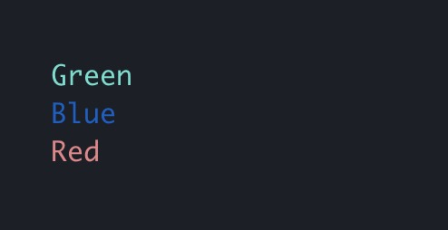
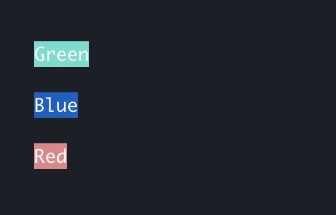
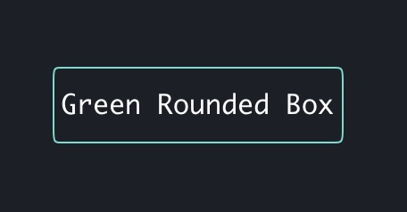
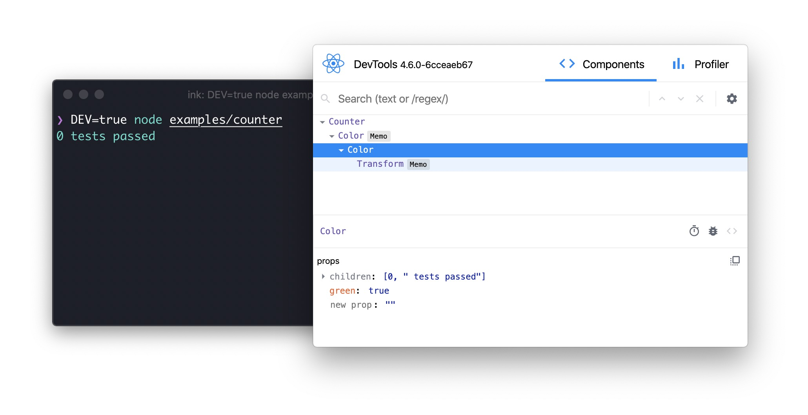

<h1 align="center">
	<br>
	<br>
	
	<br>
	<br>
	<br>
</h1>

> React for CLIs. Build and test your CLI output using components.

[](https://github.com/vadimdemedes/ink/actions)
[](https://npmjs.com/package/ink)

Ink provides the same component-based UI building experience that React offers in the browser, but for command-line apps.
It uses [Yoga](https://github.com/facebook/yoga) to build Flexbox layouts in the terminal, so most CSS-like props are available in Ink as well.
If you are already familiar with React, you already know Ink.

Since Ink is a React renderer, it means that all features of React are supported.
Head over to [React](https://reactjs.org) website for documentation on how to use it.
Only Ink's methods will be documented in this readme.

**Note:** This is documentation for Ink 3. If you're looking for docs on Ink 2, check out [this release](https://github.com/vadimdemedes/ink/tree/v2.7.1). There's also a [migration guide](migrate.md) from Ink 2 available.

## Install

```
$ npm install ink react
```

## Usage

```jsx
import React, {useState, useEffect} from 'react';
import {render, Text} from 'ink';

const Counter = () => {
	const [counter, setCounter] = useState(0);

	useEffect(() => {
		const timer = setInterval(() => {
			setCounter(previousCounter => previousCounter + 1);
		}, 100);

		return () => {
			clearInterval(timer);
		};
	}, []);

	return <Text color="green">{counter} tests passed</Text>;
};

render(<Counter />);
```


You can also check it out live on [repl.it sandbox](https://ink-counter-demo.vadimdemedes.repl.run/).
Feel free to play around with the code and fork this repl at [https://repl.it/@vadimdemedes/ink-counter-demo](https://repl.it/@vadimdemedes/ink-counter-demo).

## Who's Using Ink?

- [Gatsby](https://www.gatsbyjs.org) - Gatsby is a modern web framework for blazing fast websites.
- [tap](https://node-tap.org) - A Test-Anything-Protocol library for JavaScript.
- [Terraform CDK](https://github.com/hashicorp/terraform-cdk) - CDK (Cloud Development Kit) for HashiCorp Terraform.
- [Twilio's SIGNAL](https://github.com/twilio-labs/plugin-signal2020) - CLI for Twilio's SIGNAL conference. [Blog post](https://www.twilio.com/blog/building-conference-cli-in-react).
- [Typewriter](https://github.com/segmentio/typewriter) - Generates strongly-typed [Segment](https://segment.com) analytics clients from arbitrary JSON Schema.
- [Prisma](https://www.prisma.io) - The unified data layer for modern applications.
- [Wallace](https://www.projectwallace.com) - Pretty CSS analytics on the CLI.
- [Blitz](https://blitzjs.com) - The Fullstack React Framework.
- [New York Times](https://github.com/nytimes/kyt) - NYT uses Ink `kyt` - a toolkit that encapsulates and manages the configuration for web apps.
- [tink](https://github.com/npm/tink) - Next-generation runtime and package manager.
- [loki](https://github.com/oblador/loki) - Visual Regression Testing for Storybook.
- [Bit](https://github.com/teambit/bit) - Build, distribute and collaborate on components.
- [Remirror](https://github.com/remirror/remirror) - Your friendly, world-class editor toolkit.
- [Prime](https://github.com/birkir/prime) - Open source GraphQL CMS.
- [Splash](https://github.com/Shopify/polaris-react/tree/master/scripts/splash) - Observe the splash zone of a change across the Shopify's [Polaris](https://polaris.shopify.com) component library.
- [emoj](https://github.com/sindresorhus/emoj) - Find relevant emoji on the command-line.
- [emma](https://github.com/maticzav/emma-cli) - Terminal assistant to find and install npm packages.
- [swiff](https://github.com/simple-integrated-marketing/swiff) - Multi-environment command line tools for time-saving web developers.
- [share](https://github.com/marionebl/share-cli) - Quickly share files from your command line.
- [Kubelive](https://github.com/ameerthehacker/kubelive) - CLI for Kubernetes to provide live data about the cluster and its resources.
- [changelog-view](https://github.com/jdeniau/changelog-view) - Tool view changelog in console.
- [cfpush](https://github.com/mamachanko/cfpush) - An interactive Cloud Foundry tutorial in your terminal.
- [startd](https://github.com/mgrip/startd) - Turn your React component into a web app from the command-line.
- [wiki-cli](https://github.com/hexrcs/wiki-cli) - Search Wikipedia and read summaries directly in your terminal.
- [garson](https://github.com/goliney/garson) - Build interactive config-based command-line interfaces.
- [git-contrib-calendar](https://github.com/giannisp/git-contrib-calendar) - Display a contributions calendar for any git repository.
- [gitgud](https://github.com/GitGud-org/GitGud) - An interactive command-line GUI for Git.
- [Autarky](https://github.com/pranshuchittora/autarky) - An interactive CLI to find and delete old `node_modules` directories in order to free up disk space.
- [fast-cli](https://github.com/sindresorhus/fast-cli) - Test your download and upload speed.
- [tasuku](https://github.com/privatenumber/tasuku) - Minimal task runner.

## Contents

- [Getting Started](#getting-started)
- [Components](#components)
  - [`<Text>`](#text)
  - [`<Box>`](#box)
  - [`<Newline>`](#newline)
  - [`<Spacer>`](#spacer)
  - [`<Static>`](#static)
  - [`<Transform>`](#transform)
- [Hooks](#hooks)
  - [`useInput`](#useinputinputhandler-options)
  - [`useApp`](#useapp)
  - [`useStdin`](#usestdin)
  - [`useStdout`](#usestdout)
  - [`useStderr`](#usestderr)
  - [`useFocus`](#usefocusoptions)
  - [`useFocusManager`](#usefocusmanager)
- [API](#api)
- [Testing](#testing)
- [Using React Devtools](#using-react-devtools)
- [Useful Components](#useful-components)
- [Useful Hooks](#useful-hooks)
- [Examples](#examples)

## Getting Started

Use [create-ink-app](https://github.com/vadimdemedes/create-ink-app) to quickly scaffold a new Ink-based CLI.

```
$ mkdir my-ink-cli
$ cd my-ink-cli
$ npx create-ink-app
```

Alternatively, create a TypeScript project:

```
$ npx create-ink-app --typescript
```

<details><summary>Manual setup</summary>
<p>
Ink requires the same Babel setup as you would do for regular React-based apps in the browser.

Set up Babel with a React preset to ensure all examples in this readme work as expected.
After [installing Babel](https://babeljs.io/docs/en/usage), install `@babel/preset-react` and insert the following configuration in `babel.config.json`:

```
$ npm install --save-dev @babel/preset-react
```

```json
{
	"presets": [
		"@babel/preset-react",
		[
			"@babel/preset-env",
			{
				"targets": {
					"node": true
				}
			}
		]
	]
}
```

Next, create a file `source.js`, where you'll type code that uses Ink:

```jsx
import React from 'react';
import {render, Text} from 'ink';

const Demo = () => <Text>Hello World</Text>;

render(<Demo />);
```

Then, transpile this file with Babel:

```
$ npx babel source.js -o cli.js
```

Now you can run `cli.js` with Node.js:

```
$ node cli
```

If you don't like transpiling files during development, you can use [import-jsx](https://github.com/vadimdemedes/import-jsx) to `require()` a JSX file and transpile it on the fly.

</p>
</details>

Ink uses [Yoga](https://github.com/facebook/yoga) - a Flexbox layout engine to build great user interfaces for your CLIs using familiar CSS-like props you've used when building apps for the browser.
It's important to remember that each element is a Flexbox container.
Think of it as if each `<div>` in the browser had `display: flex`.
See [`<Box>`](#box) built-in component below for documentation on how to use Flexbox layouts in Ink.
Note that all text must be wrapped in a [`<Text>`](#text) component.

## Components

### `<Text>`

This component can display text, and change its style to make it bold, underline, italic or strikethrough.

```jsx
import {render, Text} from 'ink';

const Example = () => (
	<>
		<Text color="green">I am green</Text>
		<Text color="black" backgroundColor="white">
			I am black on white
		</Text>
		<Text color="#ffffff">I am white</Text>
		<Text bold>I am bold</Text>
		<Text italic>I am italic</Text>
		<Text underline>I am underline</Text>
		<Text strikethrough>I am strikethrough</Text>
		<Text inverse>I am inversed</Text>
	</>
);

render(<Example />);
```

**Note:** `<Text>` allows only text nodes and nested `<Text>` components inside of it. For example, `<Box>` component can't be used inside `<Text>`.

#### color

Type: `string`

Change text color.
Ink uses [chalk](https://github.com/chalk/chalk) under the hood, so all its functionality is supported.

```jsx
<Text color="green">Green</Text>
<Text color="#005cc5">Blue</Text>
<Text color="rgb(232, 131, 136)">Red</Text>
```



#### backgroundColor

Type: `string`

Same as `color` above, but for background.

```jsx
<Text backgroundColor="green" color="white">Green</Text>
<Text backgroundColor="#005cc5" color="white">Blue</Text>
<Text backgroundColor="rgb(232, 131, 136)" color="white">Red</Text>
```



#### dimColor

Type: `boolean`\
Default: `false`

Dim the color (emit a small amount of light).

```jsx
<Text color="red" dimColor>
	Dimmed Red
</Text>
```


#### bold

Type: `boolean`\
Default: `false`

Make the text bold.

#### italic

Type: `boolean`\
Default: `false`

Make the text italic.

#### underline

Type: `boolean`\
Default: `false`

Make the text underlined.

#### strikethrough

Type: `boolean`\
Default: `false`

Make the text crossed with a line.

#### inverse

Type: `boolean`\
Default: `false`

Inverse background and foreground colors.

```jsx
<Text inverse color="yellow">
	Inversed Yellow
</Text>
```


#### wrap

Type: `string`\
Allowed values: `wrap` `truncate` `truncate-start` `truncate-middle` `truncate-end`\
Default: `wrap`

This property tells Ink to wrap or truncate text if its width is larger than container.
If `wrap` is passed (by default), Ink will wrap text and split it into multiple lines.
If `truncate-*` is passed, Ink will truncate text instead, which will result in one line of text with the rest cut off.

```jsx
<Box width={7}>
	<Text>Hello World</Text>
</Box>
//=> 'Hello\nWorld'

// `truncate` is an alias to `truncate-end`
<Box width={7}>
	<Text wrap="truncate">Hello World</Text>
</Box>
//=> 'Hello…'

<Box width={7}>
	<Text wrap="truncate-middle">Hello World</Text>
</Box>
//=> 'He…ld'

<Box width={7}>
	<Text wrap="truncate-start">Hello World</Text>
</Box>
//=> '…World'
```

### `<Box>`

`<Box>` is an essential Ink component to build your layout.
It's like `<div style="display: flex">` in the browser.

```jsx
import {render, Box, Text} from 'ink';

const Example = () => (
	<Box margin={2}>
		<Text>This is a box with margin</Text>
	</Box>
);

render(<Example />);
```

#### Dimensions

##### width

Type: `number` `string`

Width of the element in spaces.
You can also set it in percent, which will calculate the width based on the width of parent element.

```jsx
<Box width={4}>
	<Text>X</Text>
</Box>
//=> 'X   '
```

```jsx
<Box width={10}>
	<Box width="50%">
		<Text>X</Text>
	</Box>
	<Text>Y</Text>
</Box>
//=> 'X    Y'
```

##### height

Type: `number` `string`

Height of the element in lines (rows).
You can also set it in percent, which will calculate the height based on the height of parent element.

```jsx
<Box height={4}>
	<Text>X</Text>
</Box>
//=> 'X\n\n\n'
```

```jsx
<Box height={6} flexDirection="column">
	<Box height="50%">
		<Text>X</Text>
	</Box>
	<Text>Y</Text>
</Box>
//=> 'X\n\n\nY\n\n'
```

##### minWidth

Type: `number`

Sets a minimum width of the element.
Percentages aren't supported yet, see https://github.com/facebook/yoga/issues/872.

##### minHeight

Type: `number`

Sets a minimum height of the element.
Percentages aren't supported yet, see https://github.com/facebook/yoga/issues/872.

#### Padding

##### paddingTop

Type: `number`\
Default: `0`

Top padding.

##### paddingBottom

Type: `number`\
Default: `0`

Bottom padding.

##### paddingLeft

Type: `number`\
Default: `0`

Left padding.

##### paddingRight

Type: `number`\
Default: `0`

Right padding.

##### paddingX

Type: `number`\
Default: `0`

Horizontal padding. Equivalent to setting `paddingLeft` and `paddingRight`.

##### paddingY

Type: `number`\
Default: `0`

Vertical padding. Equivalent to setting `paddingTop` and `paddingBottom`.

##### padding

Type: `number`\
Default: `0`

Padding on all sides. Equivalent to setting `paddingTop`, `paddingBottom`, `paddingLeft` and `paddingRight`.

```jsx
<Box paddingTop={2}>Top</Box>
<Box paddingBottom={2}>Bottom</Box>
<Box paddingLeft={2}>Left</Box>
<Box paddingRight={2}>Right</Box>
<Box paddingX={2}>Left and right</Box>
<Box paddingY={2}>Top and bottom</Box>
<Box padding={2}>Top, bottom, left and right</Box>
```

#### Margin

##### marginTop

Type: `number`\
Default: `0`

Top margin.

##### marginBottom

Type: `number`\
Default: `0`

Bottom margin.

##### marginLeft

Type: `number`\
Default: `0`

Left margin.

##### marginRight

Type: `number`\
Default: `0`

Right margin.

##### marginX

Type: `number`\
Default: `0`

Horizontal margin. Equivalent to setting `marginLeft` and `marginRight`.

##### marginY

Type: `number`\
Default: `0`

Vertical margin. Equivalent to setting `marginTop` and `marginBottom`.

##### margin

Type: `number`\
Default: `0`

Margin on all sides. Equivalent to setting `marginTop`, `marginBottom`, `marginLeft` and `marginRight`.

```jsx
<Box marginTop={2}>Top</Box>
<Box marginBottom={2}>Bottom</Box>
<Box marginLeft={2}>Left</Box>
<Box marginRight={2}>Right</Box>
<Box marginX={2}>Left and right</Box>
<Box marginY={2}>Top and bottom</Box>
<Box margin={2}>Top, bottom, left and right</Box>
```

#### Flex

##### flexGrow

Type: `number`\
Default: `0`

See [flex-grow](https://css-tricks.com/almanac/properties/f/flex-grow/).

```jsx
<Box>
	<Text>Label:</Text>
	<Box flexGrow={1}>
		<Text>Fills all remaining space</Text>
	</Box>
</Box>
```

##### flexShrink

Type: `number`\
Default: `1`

See [flex-shrink](https://css-tricks.com/almanac/properties/f/flex-shrink/).

```jsx
<Box width={20}>
	<Box flexShrink={2} width={10}>
		<Text>Will be 1/4</Text>
	</Box>
	<Box width={10}>
		<Text>Will be 3/4</Text>
	</Box>
</Box>
```

##### flexBasis

Type: `number` `string`

See [flex-basis](https://css-tricks.com/almanac/properties/f/flex-basis/).

```jsx
<Box width={6}>
	<Box flexBasis={3}>
		<Text>X</Text>
	</Box>
	<Text>Y</Text>
</Box>
//=> 'X  Y'
```

```jsx
<Box width={6}>
	<Box flexBasis="50%">
		<Text>X</Text>
	</Box>
	<Text>Y</Text>
</Box>
//=> 'X  Y'
```

##### flexDirection

Type: `string`\
Allowed values: `row` `row-reverse` `column` `column-reverse`

See [flex-direction](https://css-tricks.com/almanac/properties/f/flex-direction/).

```jsx
<Box>
	<Box marginRight={1}>
		<Text>X</Text>
	</Box>
	<Text>Y</Text>
</Box>
// X Y

<Box flexDirection="row-reverse">
	<Text>X</Text>
	<Box marginRight={1}>
		<Text>Y</Text>
	</Box>
</Box>
// Y X

<Box flexDirection="column">
	<Text>X</Text>
	<Text>Y</Text>
</Box>
// X
// Y

<Box flexDirection="column-reverse">
	<Text>X</Text>
	<Text>Y</Text>
</Box>
// Y
// X
```

##### alignItems

Type: `string`\
Allowed values: `flex-start` `center` `flex-end`

See [align-items](https://css-tricks.com/almanac/properties/a/align-items/).

```jsx
<Box alignItems="flex-start">
	<Box marginRight={1}>
		<Text>X</Text>
	</Box>
	<Text>
		A
		<Newline/>
		B
		<Newline/>
		C
	</Text>
</Box>
// X A
//   B
//   C

<Box alignItems="center">
	<Box marginRight={1}>
		<Text>X</Text>
	</Box>
	<Text>
		A
		<Newline/>
		B
		<Newline/>
		C
	</Text>
</Box>
//   A
// X B
//   C

<Box alignItems="flex-end">
	<Box marginRight={1}>
		<Text>X</Text>
	</Box>
	<Text>
		A
		<Newline/>
		B
		<Newline/>
		C
	</Text>
</Box>
//   A
//   B
// X C
```

##### alignSelf

Type: `string`\
Default: `auto`\
Allowed vales: `auto` `flex-start` `center` `flex-end`

See [align-self](https://css-tricks.com/almanac/properties/a/align-self/).

```jsx
<Box height={3}>
	<Box alignSelf="flex-start">
		<Text>X</Text>
	</Box>
</Box>
// X
//
//

<Box height={3}>
	<Box alignSelf="center">
		<Text>X</Text>
	</Box>
</Box>
//
// X
//

<Box height={3}>
	<Box alignSelf="flex-end">
		<Text>X</Text>
	</Box>
</Box>
//
//
// X
```

##### justifyContent

Type: `string`\
Allowed values: `flex-start` `center` `flex-end` `space-between` `space-around`

See [justify-content](https://css-tricks.com/almanac/properties/j/justify-content/).

```jsx
<Box justifyContent="flex-start">
	<Text>X</Text>
</Box>
// [X      ]

<Box justifyContent="center">
	<Text>X</Text>
</Box>
// [   X   ]

<Box justifyContent="flex-end">
	<Text>X</Text>
</Box>
// [      X]

<Box justifyContent="space-between">
	<Text>X</Text>
	<Text>Y</Text>
</Box>
// [X      Y]

<Box justifyContent="space-around">
	<Text>X</Text>
	<Text>Y</Text>
</Box>
// [  X   Y  ]
```

#### Visibility

##### display

Type: `string`\
Allowed values: `flex` `none`\
Default: `flex`

Set this property to `none` to hide the element.

#### Borders

##### borderStyle

Type: `string`\
Allowed values: `single` `double` `round` `bold` `singleDouble` `doubleSingle` `classic`

Add a border with a specified style.
If `borderStyle` is `undefined` (which it is by default), no border will be added.
Ink uses border styles from [`cli-boxes`](https://github.com/sindresorhus/cli-boxes) module.

```jsx
<Box flexDirection="column">
	<Box>
		<Box borderStyle="single" marginRight={2}>
			<Text>single</Text>
		</Box>

		<Box borderStyle="double" marginRight={2}>
			<Text>double</Text>
		</Box>

		<Box borderStyle="round" marginRight={2}>
			<Text>round</Text>
		</Box>

		<Box borderStyle="bold">
			<Text>bold</Text>
		</Box>
	</Box>

	<Box marginTop={1}>
		<Box borderStyle="singleDouble" marginRight={2}>
			<Text>singleDouble</Text>
		</Box>

		<Box borderStyle="doubleSingle" marginRight={2}>
			<Text>doubleSingle</Text>
		</Box>

		<Box borderStyle="classic">
			<Text>classic</Text>
		</Box>
	</Box>
</Box>
```


See example in [examples/borders](examples/borders/borders.js).

##### borderColor

Type: `string`

Change border color.
Accepts the same values as [`color`](#color) in `<Text>` component.

```jsx
<Box borderStyle="round" borderColor="green">
	<Text>Green Rounded Box</Text>
</Box>
```



### `<Newline>`

Adds one or more newline (`\n`) characters.
Must be used within `<Text>` components.

#### count

Type: `number`\
Default: `1`

Number of newlines to insert.

```jsx
import {render, Text, Newline} from 'ink';

const Example = () => (
	<Text>
		<Text color="green">Hello</Text>
		<Newline />
		<Text color="red">World</Text>
	</Text>
);

render(<Example />);
```

Output:

```
Hello
World
```

### `<Spacer>`

A flexible space that expands along the major axis of its containing layout.
It's useful as a shortcut for filling all the available spaces between elements.

For example, using `<Spacer>` in a `<Box>` with default flex direction (`row`) will position "Left" on the left side and will push "Right" to the right side.

```jsx
import {render, Box, Text, Spacer} from 'ink';

const Example = () => (
	<Box>
		<Text>Left</Text>
		<Spacer />
		<Text>Right</Text>
	</Box>
);

render(<Example />);
```

In a vertical flex direction (`column`), it will position "Top" to the top of the container and push "Bottom" to the bottom of it.
Note, that container needs to be tall to enough to see this in effect.

```jsx
import {render, Box, Text, Spacer} from 'ink';

const Example = () => (
	<Box flexDirection="column" height={10}>
		<Text>Top</Text>
		<Spacer />
		<Text>Bottom</Text>
	</Box>
);

render(<Example />);
```

### `<Static>`

`<Static>` component permanently renders its output above everything else.
It's useful for displaying activity like completed tasks or logs - things that
are not changing after they're rendered (hence the name "Static").

It's preferred to use `<Static>` for use cases like these, when you can't know
or control the amount of items that need to be rendered.

For example, [Tap](https://github.com/tapjs/node-tap) uses `<Static>` to display
a list of completed tests. [Gatsby](https://github.com/gatsbyjs/gatsby) uses it
to display a list of generated pages, while still displaying a live progress bar.

```jsx
import React, {useState, useEffect} from 'react';
import {render, Static, Box, Text} from 'ink';

const Example = () => {
	const [tests, setTests] = useState([]);

	useEffect(() => {
		let completedTests = 0;
		let timer;

		const run = () => {
			// Fake 10 completed tests
			if (completedTests++ < 10) {
				setTests(previousTests => [
					...previousTests,
					{
						id: previousTests.length,
						title: `Test #${previousTests.length + 1}`
					}
				]);

				setTimeout(run, 100);
			}
		};

		run();

		return () => {
			clearTimeout(timer);
		};
	}, []);

	return (
		<>
			{/* This part will be rendered once to the terminal */}
			<Static items={tests}>
				{test => (
					<Box key={test.id}>
						<Text color="green">✔ {test.title}</Text>
					</Box>
				)}
			</Static>

			{/* This part keeps updating as state changes */}
			<Box marginTop={1}>
				<Text dimColor>Completed tests: {tests.length}</Text>
			</Box>
		</>
	);
};

render(<Example />);
```

**Note:** `<Static>` only renders new items in `items` prop and ignores items
that were previously rendered. This means that when you add new items to `items`
array, changes you make to previous items will not trigger a rerender.

See [examples/static](examples/static/static.js) for an example usage of `<Static>` component.

#### items

Type: `Array`

Array of items of any type to render using a function you pass as a component child.

#### style

Type: `object`

Styles to apply to a container of child elements.
See [`<Box>`](#box) for supported properties.

```jsx
<Static items={...} style={{padding: 1}}>
	{...}
</Static>
```

#### children(item)

Type: `Function`

Function that is called to render every item in `items` array.
First argument is an item itself and second argument is index of that item in
`items` array.

Note that `key` must be assigned to the root component.

```jsx
<Static items={['a', 'b', 'c']}>
	{(item, index) => {
		// This function is called for every item in ['a', 'b', 'c']
		// `item` is 'a', 'b', 'c'
		// `index` is 0, 1, 2
		return (
			<Box key={index}>
				<Text>Item: {item}</Text>
			</Box>
		);
	}}
</Static>
```

### `<Transform>`

Transform a string representation of React components before they are written to output.
For example, you might want to apply a [gradient to text](https://github.com/sindresorhus/ink-gradient), [add a clickable link](https://github.com/sindresorhus/ink-link) or [create some text effects](https://github.com/sindresorhus/ink-big-text).
These use cases can't accept React nodes as input, they are expecting a string.
That's what `<Transform>` component does, it gives you an output string of its child components and lets you transform it in any way.

**Note:** `<Transform>` must be applied only to `<Text>` children components and shouldn't change the dimensions of the output, otherwise layout will be incorrect.

```jsx
import {render, Transform} from 'ink';

const Example = () => (
	<Transform transform={output => output.toUpperCase()}>
		<Text>Hello World</Text>
	</Transform>
);

render(<Example />);
```

Since `transform` function converts all characters to upper case, final output that's rendered to the terminal will be "HELLO WORLD", not "Hello World".

#### transform(children)

Type: `Function`

Function which transforms children output.
It accepts children and must return transformed children too.

##### children

Type: `string`

Output of child components.

## Hooks

### useInput(inputHandler, options?)

This hook is used for handling user input.
It's a more convenient alternative to using `useStdin` and listening to `data` events.
The callback you pass to `useInput` is called for each character when user enters any input.
However, if user pastes text and it's more than one character, the callback will be called only once and the whole string will be passed as `input`.
You can find a full example of using `useInput` at [examples/use-input](examples/use-input/use-input.js).

```jsx
import {useInput} from 'ink';

const UserInput = () => {
	useInput((input, key) => {
		if (input === 'q') {
			// Exit program
		}

		if (key.leftArrow) {
			// Left arrow key pressed
		}
	});

	return …
};
```

#### inputHandler(input, key)

Type: `Function`

The handler function that you pass to `useInput` receives two arguments:

##### input

Type: `string`

The input that the program received.

##### key

Type: `object`

Handy information about a key that was pressed.

###### key.leftArrow

###### key.rightArrow

###### key.upArrow

###### key.downArrow

Type: `boolean`\
Default: `false`

If an arrow key was pressed, the corresponding property will be `true`.
For example, if user presses left arrow key, `key.leftArrow` equals `true`.

###### key.return

Type: `boolean`\
Default: `false`

Return (Enter) key was pressed.

###### key.escape

Type: `boolean`\
Default: `false`

Escape key was pressed.

###### key.ctrl

Type: `boolean`\
Default: `false`

Ctrl key was pressed.

###### key.shift

Type: `boolean`\
Default: `false`

Shift key was pressed.

###### key.tab

Type: `boolean`\
Default: `false`

Tab key was pressed.

###### key.backspace

Type: `boolean`\
Default: `false`

Backspace key was pressed.

###### key.delete

Type: `boolean`\
Default: `false`

Delete key was pressed.

###### key.pageDown

###### key.pageUp

Type: `boolean`\
Default: `false`

If Page Up or Page Down key was pressed, the corresponding property will be `true`.
For example, if user presses Page Down, `key.pageDown` equals `true`.

###### key.meta

Type: `boolean`\
Default: `false`

[Meta key](https://en.wikipedia.org/wiki/Meta_key) was pressed.

#### options

Type: `object`

##### isActive

Type: `boolean`\
Default: `true`

Enable or disable capturing of user input.
Useful when there are multiple `useInput` hooks used at once to avoid handling the same input several times.

### useApp()

`useApp` is a React hook, which exposes a method to manually exit the app (unmount).

#### exit(error?)

Type: `Function`

Exit (unmount) the whole Ink app.

##### error

Type: `Error`

Optional error. If passed, [`waitUntilExit`](waituntilexit) will reject with that error.

```js
import {useApp} from 'ink';

const Example = () => {
	const {exit} = useApp();

	// Exit the app after 5 seconds
	useEffect(() => {
		setTimeout(() => {
			exit();
		}, 5000);
	}, []);

	return …
};
```

### useStdin()

`useStdin` is a React hook, which exposes stdin stream.

#### stdin

Type: `stream.Readable`\
Default: `process.stdin`

Stdin stream passed to `render()` in `options.stdin` or `process.stdin` by default.
Useful if your app needs to handle user input.

```js
import {useStdin} from 'ink';

const Example = () => {
	const {stdin} = useStdin();

	return …
};
```

#### isRawModeSupported

Type: `boolean`

A boolean flag determining if the current `stdin` supports `setRawMode`.
A component using `setRawMode` might want to use `isRawModeSupported` to nicely fall back in environments where raw mode is not supported.

```jsx
import {useStdin} from 'ink';

const Example = () => {
	const {isRawModeSupported} = useStdin();

	return isRawModeSupported ? (
		<MyInputComponent />
	) : (
		<MyComponentThatDoesntUseInput />
	);
};
```

#### setRawMode(isRawModeEnabled)

Type: `function`

##### isRawModeEnabled

Type: `boolean`

See [`setRawMode`](https://nodejs.org/api/tty.html#tty_readstream_setrawmode_mode).
Ink exposes this function to be able to handle <kbd>Ctrl</kbd>+<kbd>C</kbd>, that's why you should use Ink's `setRawMode` instead of `process.stdin.setRawMode`.

**Warning:** This function will throw unless the current `stdin` supports `setRawMode`. Use [`isRawModeSupported`](#israwmodesupported) to detect `setRawMode` support.

```js
import {useStdin} from 'ink';

const Example = () => {
	const {setRawMode} = useStdin();

	useEffect(() => {
		setRawMode(true);

		return () => {
			setRawMode(false);
		};
	});

	return …
};
```

### useStdout()

`useStdout` is a React hook, which exposes stdout stream, where Ink renders your app.

#### stdout

Type: `stream.Writable`\
Default: `process.stdout`

```js
import {useStdout} from 'ink';

const Example = () => {
	const {stdout} = useStdout;

	return …
};
```

#### write(data)

Write any string to stdout, while preserving Ink's output.
It's useful when you want to display some external information outside of Ink's rendering and ensure there's no conflict between the two.
It's similar to `<Static>`, except it can't accept components, it only works with strings.

##### data

Type: `string`

Data to write to stdout.

```js
import {useStdout} from 'ink';

const Example = () => {
	const {write} = useStdout();

	useEffect(() => {
		// Write a single message to stdout, above Ink's output
		write('Hello from Ink to stdout\n');
	}, []);

	return …
};
```

See additional usage example in [examples/use-stdout](examples/use-stdout/use-stdout.js).

### useStderr()

`useStderr` is a React hook, which exposes stderr stream.

#### stderr

Type: `stream.Writable`\
Default: `process.stderr`

Stderr stream.

```js
import {useStderr} from 'ink';

const Example = () => {
	const {stderr} = useStderr();

	return …
};
```

#### write(data)

Write any string to stderr, while preserving Ink's output.

It's useful when you want to display some external information outside of Ink's rendering and ensure there's no conflict between the two.
It's similar to `<Static>`, except it can't accept components, it only works with strings.

##### data

Type: `string`

Data to write to stderr.

```js
import {useStderr} from 'ink';

const Example = () => {
	const {write} = useStderr();

	useEffect(() => {
		// Write a single message to stderr, above Ink's output
		write('Hello from Ink to stderr\n');
	}, []);

	return …
};
```

### useFocus(options?)

Component that uses `useFocus` hook becomes "focusable" to Ink, so when user presses <kbd>Tab</kbd>, Ink will switch focus to this component.
If there are multiple components that execute `useFocus` hook, focus will be given to them in the order that these components are rendered in.
This hook returns an object with `isFocused` boolean property, which determines if this component is focused or not.

#### options

##### autoFocus

Type: `boolean`\
Default: `false`

Auto focus this component, if there's no active (focused) component right now.

##### isActive

Type: `boolean`\
Default: `true`

Enable or disable this component's focus, while still maintaining its position in the list of focusable components.
This is useful for inputs that are temporarily disabled.

##### id

Type: `string`\
Required: `false`

Set a component's focus ID, which can be used to programmatically focus the component. This is useful for large interfaces with many focusable elements, to avoid having to cycle through all of them.

```jsx
import {render, useFocus, Text} from 'ink';

const Example = () => {
	const {isFocused} = useFocus();

	return <Text>{isFocused ? 'I am focused' : 'I am not focused'}</Text>;
};

render(<Example />);
```

See example in [examples/use-focus](examples/use-focus/use-focus.js) and [examples/use-focus-with-id](examples/use-focus/use-focus-with-id.js).

### useFocusManager()

This hook exposes methods to enable or disable focus management for all components or manually switch focus to next or previous components.

#### enableFocus()

Enable focus management for all components.

**Note:** You don't need to call this method manually, unless you've disabled focus management. Focus management is enabled by default.

```js
import {useFocusManager} from 'ink';

const Example = () => {
	const {enableFocus} = useFocusManager();

	useEffect(() => {
		enableFocus();
	}, []);

	return …
};
```

#### disableFocus()

Disable focus management for all components.
Currently active component (if there's one) will lose its focus.

```js
import {useFocusManager} from 'ink';

const Example = () => {
	const {disableFocus} = useFocusManager();

	useEffect(() => {
		disableFocus();
	}, []);

	return …
};
```

#### focusNext()

Switch focus to the next focusable component.
If there's no active component right now, focus will be given to the first focusable component.
If active component is the last in the list of focusable components, focus will be switched to the first component.

**Note:** Ink calls this method when user presses <kbd>Tab</kbd>.

```js
import {useFocusManager} from 'ink';

const Example = () => {
	const {focusNext} = useFocusManager();

	useEffect(() => {
		focusNext();
	}, []);

	return …
};
```

#### focusPrevious()

Switch focus to the previous focusable component.
If there's no active component right now, focus will be given to the first focusable component.
If active component is the first in the list of focusable components, focus will be switched to the last component.

**Note:** Ink calls this method when user presses <kbd>Shift</kbd>+<kbd>Tab</kbd>.

```js
import {useFocusManager} from 'ink';

const Example = () => {
	const {focusPrevious} = useFocusManager();

	useEffect(() => {
		focusPrevious();
	}, []);

	return …
};
```

#### focus(id)

##### id

Type: `string`

Switch focus to the component with the given [`id`](#id).
If there's no component with that ID, focus will be given to the next focusable component.

```js
import {useFocusManager, useInput} from 'ink';

const Example = () => {
	const {focus} = useFocusManager();

	useInput(input => {
		if (input === 's') {
			// Focus the component with focus ID 'someId'
			focus('someId');
		}
	});

	return …
};
```

## API

#### render(tree, options?)

Returns: [`Instance`](#instance)

Mount a component and render the output.

##### tree

Type: `ReactElement`

##### options

Type: `object`

###### stdout

Type: `stream.Writable`\
Default: `process.stdout`

Output stream where app will be rendered.

###### stdin

Type: `stream.Readable`\
Default: `process.stdin`

Input stream where app will listen for input.

###### exitOnCtrlC

Type: `boolean`\
Default: `true`

Configure whether Ink should listen to Ctrl+C keyboard input and exit the app.
This is needed in case `process.stdin` is in [raw mode](https://nodejs.org/api/tty.html#tty_readstream_setrawmode_mode), because then Ctrl+C is ignored by default and process is expected to handle it manually.

###### patchConsole

Type: `boolean`\
Default: `true`

Patch console methods to ensure console output doesn't mix with Ink output.
When any of `console.*` methods are called (like `console.log()`), Ink intercepts their output, clears main output, renders output from the console method and then rerenders main output again.
That way both are visible and are not overlapping each other.

This functionality is powered by [patch-console](https://github.com/vadimdemedes/patch-console), so if you need to disable Ink's interception of output but want to build something custom, you can use it.

###### debug

Type: `boolean`\
Default: `false`

If `true`, each update will be rendered as a separate output, without replacing the previous one.

#### Instance

This is the object that `render()` returns.

##### rerender(tree)

Replace previous root node with a new one or update props of the current root node.

###### tree

Type: `ReactElement`

```jsx
// Update props of the root node
const {rerender} = render(<Counter count={1} />);
rerender(<Counter count={2} />);

// Replace root node
const {rerender} = render(<OldCounter />);
rerender(<NewCounter />);
```

##### unmount()

Manually unmount the whole Ink app.

```jsx
const {unmount} = render(<MyApp />);
unmount();
```

##### waitUntilExit()

Returns a promise, which resolves when app is unmounted.

```jsx
const {unmount, waitUntilExit} = render(<MyApp />);

setTimeout(unmount, 1000);

await waitUntilExit(); // resolves after `unmount()` is called
```

##### clear()

Clear output.

```jsx
const {clear} = render(<MyApp />);
clear();
```

#### measureElement(ref)

Measure the dimensions of a particular `<Box>` element.
It returns an object with `width` and `height` properties.
This function is useful when your component needs to know the amount of available space it has. You could use it when you need to change the layout based on the length of its content.

**Note:** `measureElement()` returns correct results only after the initial render, when layout has been calculated. Until then, `width` and `height` equal to zero. It's recommended to call `measureElement()` in a `useEffect` hook, which fires after the component has rendered.

##### ref

Type: `MutableRef`

A reference to a `<Box>` element captured with a `ref` property.
See [Refs](https://reactjs.org/docs/refs-and-the-dom.html) for more information on how to capture references.

```jsx
import {render, measureElement, Box, Text} from 'ink';

const Example = () => {
	const ref = useRef();

	useEffect(() => {
		const {width, height} = measureElement(ref.current);
		// width = 100, height = 1
	}, []);

	return (
		<Box width={100}>
			<Box ref={ref}>
				<Text>This box will stretch to 100 width</Text>
			</Box>
		</Box>
	);
};

render(<Example />);
```

## Testing

Ink components are simple to test with [ink-testing-library](https://github.com/vadimdemedes/ink-testing-library).
Here's a simple example that checks how component is rendered:

```jsx
import React from 'react';
import {Text} from 'ink';
import {render} from 'ink-testing-library';

const Test = () => <Text>Hello World</Text>;
const {lastFrame} = render(<Test />);

lastFrame() === 'Hello World'; //=> true
```

Check out [ink-testing-library](https://github.com/vadimdemedes/ink-testing-library) for more examples and full documentation.

## Using React Devtools



Ink supports [React Devtools](https://github.com/facebook/react/tree/master/packages/react-devtools) out-of-the-box.
To enable integration with React Devtools in your Ink-based CLI, run it with `DEV=true` environment variable:

```
$ DEV=true my-cli
```

Then, start React Devtools itself:

```
$ npx react-devtools
```

After it starts up, you should see the component tree of your CLI.
You can even inspect and change the props of components, and see the results immediatelly in the CLI, without restarting it.

**Note**: You must manually quit your CLI via <kbd>Ctrl</kbd>+<kbd>C</kbd> after you're done testing.

## Useful Components

- [ink-text-input](https://github.com/vadimdemedes/ink-text-input) - Text input.
- [ink-spinner](https://github.com/vadimdemedes/ink-spinner) - Spinner.
- [ink-select-input](https://github.com/vadimdemedes/ink-select-input) - Select (dropdown) input.
- [ink-link](https://github.com/sindresorhus/ink-link) - Link component.
- [ink-gradient](https://github.com/sindresorhus/ink-gradient) - Gradient color component.
- [ink-big-text](https://github.com/sindresorhus/ink-big-text) - Awesome text component.
- [ink-image](https://github.com/kevva/ink-image) - Display images inside the terminal.
- [ink-tab](https://github.com/jdeniau/ink-tab) - Tab component.
- [ink-color-pipe](https://github.com/LitoMore/ink-color-pipe) - Create color text with simpler style strings in Ink.
- [ink-multi-select](https://github.com/karaggeorge/ink-multi-select) - Select one or more values from a list
- [ink-divider](https://github.com/JureSotosek/ink-divider) - A divider component.
- [ink-progress-bar](https://github.com/brigand/ink-progress-bar) - Configurable component for rendering progress bars.
- [ink-table](https://github.com/maticzav/ink-table) - Table component.
- [ink-ascii](https://github.com/hexrcs/ink-ascii) - Awesome text component with more font choices, based on Figlet.
- [ink-markdown](https://github.com/cameronhunter/ink-markdown) - Render syntax highlighted Markdown.
- [ink-quicksearch-input](https://github.com/Eximchain/ink-quicksearch-input) - Select component with fast quicksearch-like navigation.
- [ink-confirm-input](https://github.com/kevva/ink-confirm-input) - Yes/No confirmation input.
- [ink-syntax-highlight](https://github.com/vsashyn/ink-syntax-highlight) - Code syntax highlighting.
- [ink-form](https://github.com/lukasbach/ink-form) - Form component.
- [ink-task-list](https://github.com/privatenumber/ink-task-list) - Task list component.

## Useful Hooks

- [ink-use-stdout-dimensions](https://github.com/cameronhunter/ink-monorepo/tree/master/packages/ink-use-stdout-dimensions) - Subscribe to stdout dimensions.

## Examples

- [Jest](examples/jest/jest.js) - Implementation of basic Jest UI [(live demo)](https://ink-jest-demo.vadimdemedes.repl.run/).
- [Counter](examples/counter/counter.js) - Simple counter that increments every 100ms [(live demo)](https://ink-counter-demo.vadimdemedes.repl.run/).
- [Form with Validation](https://github.com/final-form/rff-cli-example) - Manage form state using [Final Form](https://github.com/final-form/final-form#-final-form).
- [Borders](examples/borders/borders.js) - Add borders to `<Box>` component.
- [Suspense](examples/suspense/suspense.js) - Use React Suspense.
- [Table](examples/table/table.js) - Render a table with multiple columns and rows.
- [Focus Management](examples/use-focus/use-focus.js) - Use `useFocus` hook to manage focus between components.
- [User Input](examples/use-input/use-input.js) - Listen to user input.
- [Write to stdout](examples/use-stdout/use-stdout.js) - Write to stdout bypassing main Ink output.
- [Write to stderr](examples/use-stderr/use-stderr.js) - Write to stderr bypassing main Ink output.
- [Static](examples/static/static.js) - Use `<Static>` to render permanent output.
- [Child process](examples/subprocess-output) - Render output from a child process.

## Maintainers

- [Vadim Demedes](https://github.com/vadimdemedes)
- [Sindre Sorhus](https://github.com/sindresorhus)
